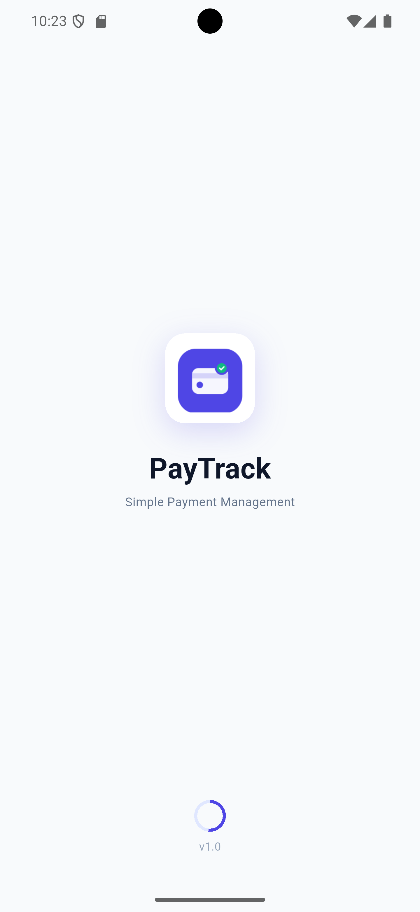
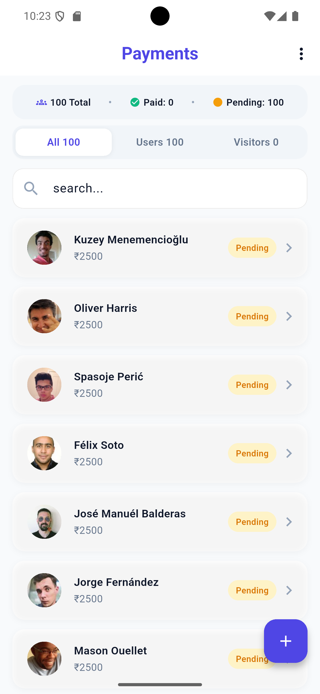
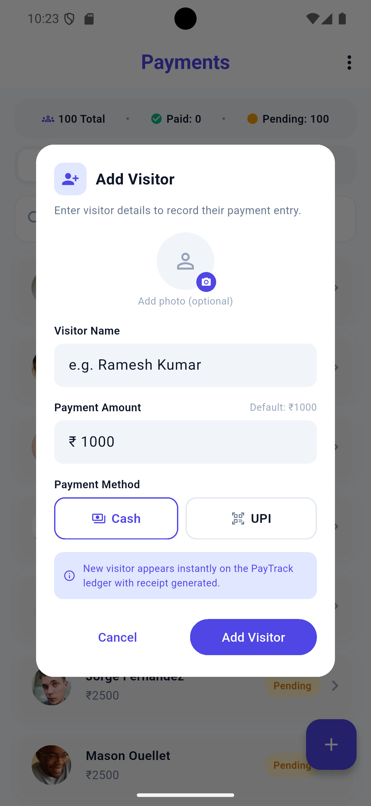
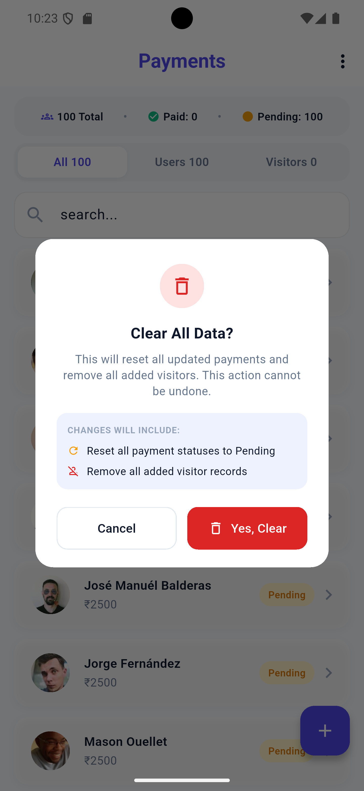

# PayTrack

A Flutter payment management application built using **MVVM Architecture**, **MobX State Management**, and the **Random User API**. PayTrack allows users to manage payment details for fetched users and manually added visitors, with support for payment methods, editable amounts, payment status, search, and payment data clearing.

---

## Features

- Clean payment management UI
- Splash screen with 4-second loading
- Random User API integration
- Fetches 100 male users
- User profile pictures
- User payment management
- Default user payment amount of ₹2500
- Editable user payment amount
- Cash and UPI payment methods
- Paid/Pending payment status
- Green border for updated user profile pictures
- Visitor management
- Add unlimited visitors
- Visitor profile pictures
- Default visitor payment amount of ₹1000
- Editable visitor payment amount
- Visitor payment methods
- Visitor Paid/Pending status
- All / Users / Visitors sections
- Payment summary
- Search users and visitors
- Clear payment and visitor data
- Loading states
- Error handling
- Responsive UI

---

## Tech Stack

- Flutter
- Dart
- MobX
- HTTP
- Random User API
- MVVM Architecture
- Repository Pattern

---

## Architecture

PayTrack follows the **MVVM architecture** with **MobX state management** and the **Repository pattern**.

```text
UI / View

   ↓

ViewModel
(MobX)

   ↓

Repository

   ↓

Remote Data Source

   ↓

Random User API
````

### Main Components

* **View Layer** – Screens and reusable UI widgets
* **ViewModel Layer** – Application state and business logic using MobX
* **Repository Layer** – Acts as a bridge between the ViewModel and data sources
* **Remote Data Source** – Handles communication with the Random User API
* **Models** – Represents user and payment-related application data
* **Core Layer** – Constants, routes, theme, and common application configuration

---
## Project Structure

```text
lib/

├── core/
│   ├── constants/
│   ├── errors/
│   └── routes/

├── data/
│   ├── models/
│   ├── remote/
│   └── repositories/

├── view/
│   ├── payment/
│   ├── splash/
│   └── update_payment/

├── view_models/

├── app.dart
└── main.dart
---

## API

PayTrack uses the **Random User API** to retrieve user information.

API endpoint:

```text
https://randomuser.me/api/?results=100&gender=male
```

The application retrieves **100 male users** from the API.

### User Information

The application uses information such as:

* User ID
* First name
* Last name
* Full name
* Email
* Profile picture

---

## Payment Management

PayTrack allows payment information to be managed for fetched users.

### User Payment

Each user starts with a default payment amount of:

```text
₹2500
```

Users can:

* Edit the payment amount
* Select Cash
* Select UPI
* Mark the payment as paid
* View the payment status

When a user's payment information is updated, their profile picture is highlighted with a green border.

```text
User

Profile Picture
     ↓
Payment Updated
     ↓
Green Border
```

The payment screen displays the user's name together with the payment amount.

---

## Visitor Management

PayTrack also supports manually added visitors.

Visitors can be added using the primary FloatingActionButton.

### Visitor Features

* Add unlimited visitors
* Visitor name
* Optional visitor profile picture
* Default payment amount of ₹1000
* Payment management
* Payment status
* Payment method
* Visitor list

The default visitor amount is:

```text
₹1000
```

Visitors are displayed separately from API users while also being included in the overall payment list.

---

## Payment Categories

The Payment Screen provides three main sections:

```text
All

Users

Visitors
```

### All

Displays both API users and manually added visitors.

### Users

Displays only users retrieved from the Random User API.

### Visitors

Displays only manually added visitors.

---

## Payment Summary

The Payment Screen provides a summary of payment information, including:

* Total records
* Paid records
* Pending records
* User count
* Visitor count

The values are calculated from the current application state rather than being hard-coded.

---

## Search

The application provides a search field for finding users and visitors by name.

Search features include:

* Search by name
* Dynamic filtering
* User results
* Visitor results
* Empty search state

The original user and visitor lists are maintained separately from the filtered results.

---

## Clear Data

PayTrack provides a **Clear Data** option for removing locally updated payment and visitor information.

When the user confirms Clear Data:

* Updated user payment information is reset.
* User payment status is reset.
* Payment methods are reset.
* Green profile-picture borders are removed.
* Added visitors are removed.
* Visitor-related state is reset.
* Payment summary values are updated.

The 100 users fetched from the API are not deleted.

---

## State Management

PayTrack uses **MobX** for application state management.

MobX manages state such as:

* API users
* Payment information
* Payment status
* Visitors
* Search state
* Loading state
* Error state

The UI observes the MobX state and automatically updates when the state changes.

```text
User Action

     ↓

ViewModel

     ↓

MobX State

     ↓

Observer

     ↓

UI Updates
```

---

## Splash Screen

The application includes a custom Splash Screen.

Features include:

* Custom application logo
* Provided color theme
* Loading indicator
* 4-second splash duration
* Automatic navigation to the Payment Screen

```text
Application Start

      ↓

Splash Screen

      ↓

4 Seconds

      ↓

Payment Screen
```

---

## Loading & Error Handling

The application provides appropriate UI states for:

* Initial loading
* API loading
* API failures
* Empty API response
* Search results
* Empty search results
* Invalid visitor input
* Payment updates
* Clear Data operations

Meaningful error messages are displayed where appropriate.

---

## Data Persistence

PayTrack currently uses **in-memory MobX state** for payment updates and visitor information.

A database is not used because persistent storage is not required by the machine-task specification.

Therefore, locally updated payment information and manually added visitors are reset when the application is restarted.

---

## Getting Started

### Prerequisites

Make sure Flutter is installed on your system.

Check your Flutter installation:

```bash
flutter doctor
```

### Clone Repository

```bash
git clone https://github.com/nishmajabin
```

### Navigate to Project

```bash
cd pay_track
```

### Install Dependencies

```bash
flutter pub get
```

### Run Application

```bash
flutter run
```

---

## Screenshots

### Splash Screen

<p align="center">
  
</p>

### Payment Screen

<p align="center">
  
</p>

### Add Visitor

<p align="center">
  
</p>

### Clear Data

<p align="center">
  
</p>

---

## Future Improvements

* Persistent local storage
* Payment history
* Payment reports
* Export payment records
* Backend synchronization
* User authentication
* Detailed visitor management
* Payment analytics
* Cloud data synchronization

---

## Author

Developed by **Nishma Jabin**

GitHub: https://github.com/nishmajabin
